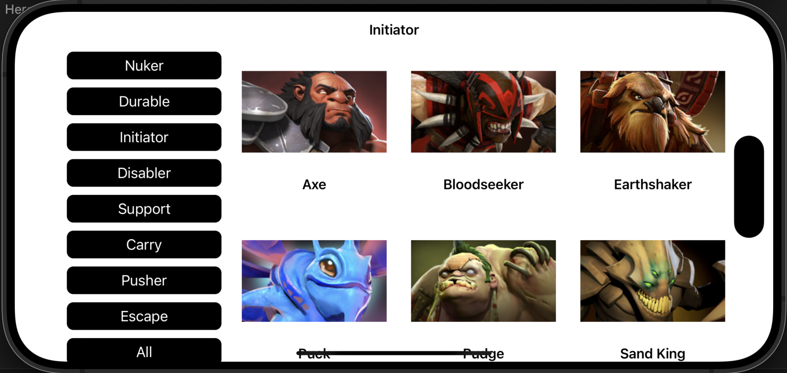
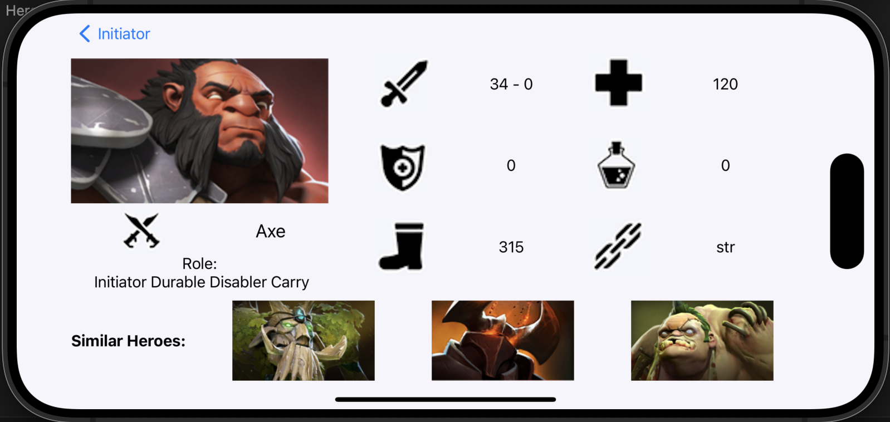

# HeroApp
An iOS app that displays a list and details of heroes and their attributes, with data stored locally using CoreData.

  &nbsp; &nbsp; &nbsp; &nbsp;

  &nbsp; &nbsp; &nbsp; &nbsp;

see it in action:

  
  &nbsp; &nbsp; &nbsp; &nbsp;
  

## Getting Started

- Once you have cloned this repo, navigate to the root of this repo.
- Run `pod install`.
- Run project.
- Done!
